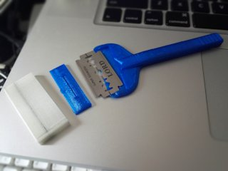
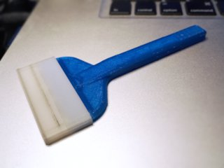

# Double-Edged Razor Blade Handle
*Holder for using double-edged razor blades as a scraper (formerly thing:1700979)*

### License
[Creative Commons - Attribution - Share Alike](https://creativecommons.org/licenses/by-sa/4.0/)

### Attribution
This is a remix of the ‘EZ-Snap Razor Blade Handle’ by AdanA ([Thingiverse thing:34481](https://www.thingiverse.com/thing:34481)).

### Gallery

[🔎](images/photo1.jpg) [🔎](images/photo2.jpg) [🔎](images/photo3.jpg)

## Description and Instructions

This is a remix of the EZ-Snap Razor Blade Handle by AdanA. It has been adapted for classic double-edged (Gillette) safety razor blades. These are only 0.1mm thick and slip under prints very easily. You won't be able to lift any prints with such a blade except very small ones, but you can use the clearance to shove a thicker and larger blade or plastic sheet under the print, and easily remove it from the platform. This also works very well as a scraper to remove skirts and any other small bits stuck to the platform. Just be careful to keep the blade at a low angle to avoid digging it into softer build surfaces like BuildTak, or making scratches in glass surfaces.

The older v2 model is still available, but I recommend to print the v3 model (see updates).

An optional cap is included to cover the blade when not in use.

Keep away from children and child-like adults.

### Printing

I recommend printing this at 0.1mm layer height to ensure that the subtle recess that prevents the blade from moving around, comes out right, and the tab to secure the blade will fit correctly. If the tab would be too loose, add sheets of adhesive tape to its underside until it is snug.

Infill for the handle doesn't really matter. The tab is best printed at 100% infill.

The cap can be printed at any reasonable layer height.

### Assembling

Before trying to mount the blade, ensure you can slide the tab into the holder from the front (not from the top). This should be the case if your printer is accurate. If the tab proves to be too wide, easiest is to just print a new one that has been scaled down by a fraction of a percent in its longer dimension. Of course you could also sand it, but take care to preserve the chamfer that is present on the original model.

Insert the blade and slide the tab into the holder from the front. Of course be careful: those blades are very sharp. I recommend using the edge of a table to firmly push the tab in the slot, so your fingers are not anywhere near the blade edge while you're exerting the most force.

[🔎](images/assembling.jpg)

## Updates

### 2016/08/03
First upload to Thingiverse.

### 2016/08/07
Version 2 of the model has a larger tab that offers a more secure mount for the blade, allowing to push harder on the blade without bending it.

### 2016/10/05
Version 3 of the model has an even larger tab and also a slightly taller structure to hold the blade in place. This version has less risk of the blade slipping out when it gets caught under a print. (I kept v2 available for those who prefer the extra bit of flexibility in the razor blade.)

## Tags

`Easy_Removal`, `razor`, `razor_blade`, `razor_holder`, `safety_razor`, `scraper`
